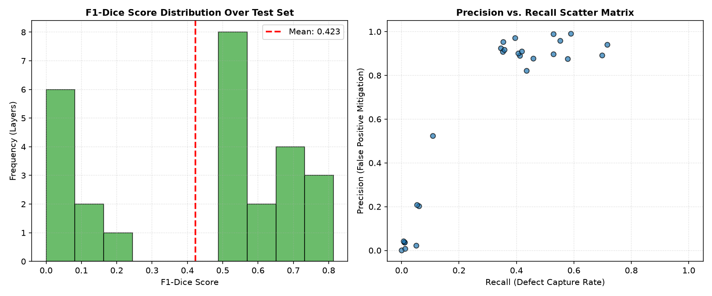
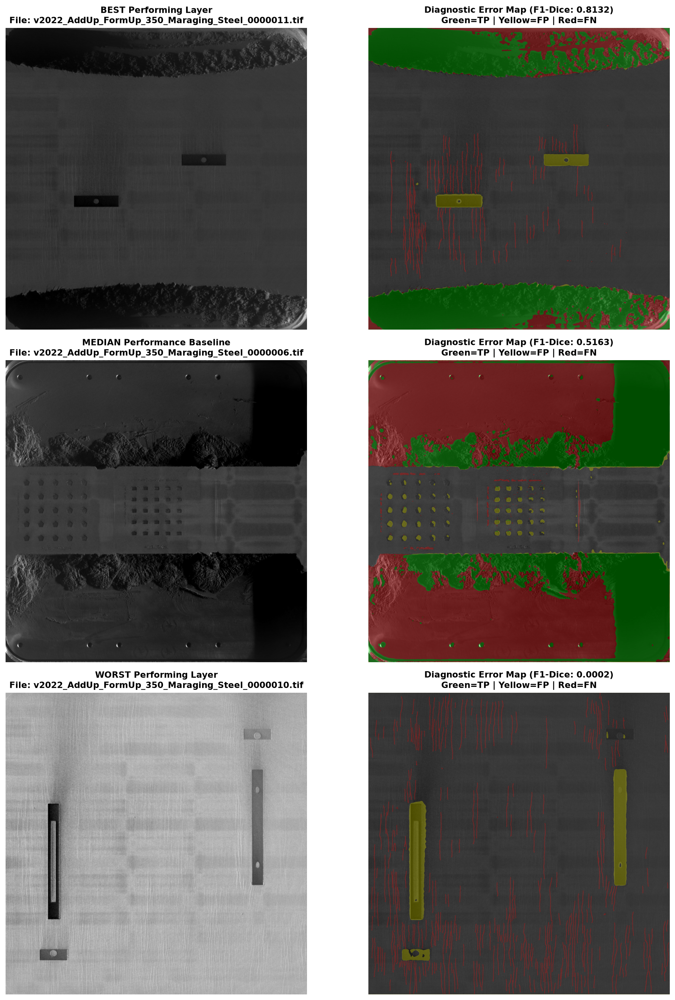
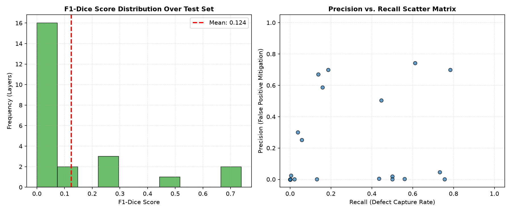
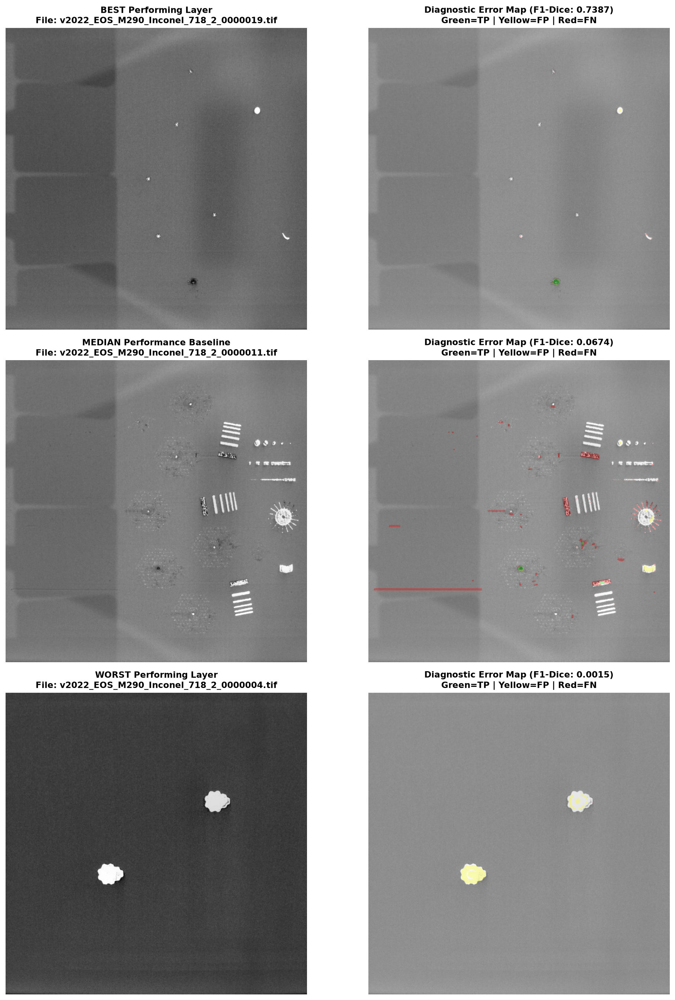
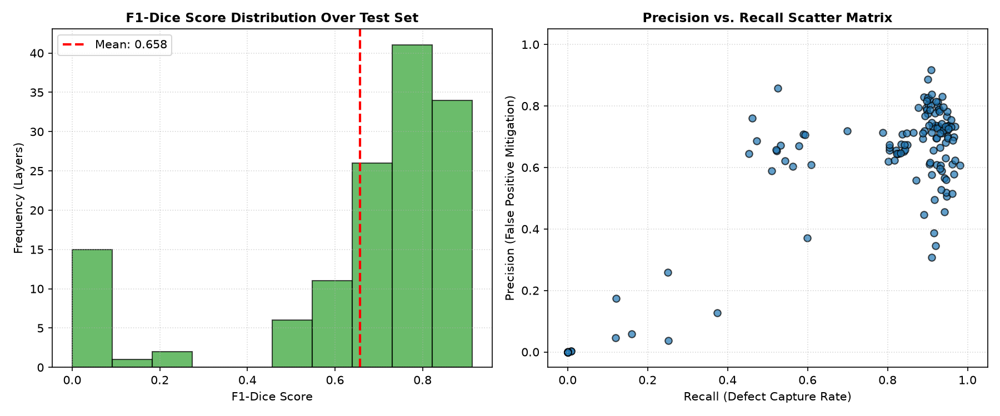
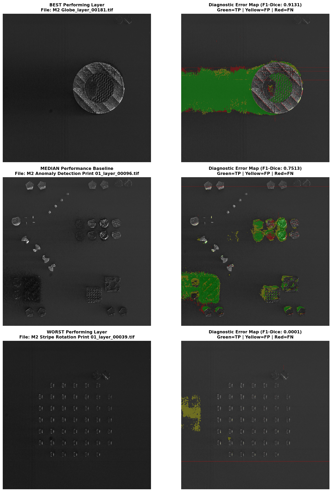

# Model Evaluation
## Training Performance

```
=================== BEST EPOCH 90/100 ===================
Losses -> Train: 0.3484 | Val: 0.2496 | LR: 0.0000100
Metrics (At 0.50 Threshold) -> Prec: 0.7563 | Rec: 0.8412 | F1: 0.7965
Metrics (At 0.25 Threshold) -> Prec: 0.7052 | Rec: 0.8797 | F1: 0.7828
 => Saved new optimum sensitive checkpoint.
```

The following assessments can be made about the training performance:
1. **High Precision + High Recall**

    Out of all the microscopic voids it flags, 75.6% are true defects (very few false alarms caused by background powder or track textures). Additionally, it successfully captures 84% of all physical defects present in the unseen material.
2. **High Confidence Boundaries (0.50 vs. 0.25 Threshold)**

    The F1-Score shifts minimally between the two threshold values, meaning that the model is making highly confident, decisive predictions.

### Key Training Takeaways
1. **Training on Non-Scaled Images Boosts Performance** 

   Previously, I had tried resizing to a standard 256x256 size, however, doing so removed a significant portion of the microscopic features.
2. **Regularization Strategy Worked Well**
    
    I added aggressive augmentations (e.g., A.GaussNoise, A.GaussianBlur, and A.RandomBrightnessContrast) strictly to the *training* dataset. The training loop was intentionally made artificially "noisy" and difficult to force the U-Net++ decoder to look for deeper geometric properties. This resulted in a higher train loss (`0.3484`) than validation loss (`0.2496`).

## Testing Performance
Testing was performed on the following completely unseen data (186 images total):
1. `Peregrine Dataset v2022-10.1/AddUp_FormUp_350/Maraging_Steel` (a printer and material that was not trained on)
2. `Peregrine Dataset v2022-10.1/EOS_M290/Inconel_718_2` (a second version of a printer and material already seen, `Inconel_718_1`)
3. 15% of the `Peregrine Dataset v2025-09` dataset (the model was trained and validated on the other 85% of the data)

**NOTE:** The first and second test sets are a generalizability study.

### Additional Features of Testing
1. Test-Time Augmentation (TTA)

   Heavily suppresses false positive and recovers false negatives without requiring weight retraining. TTA runs the full-scale slice through the network 4 separate times under different geometric flips, and then averages the probability outputs.

### AddUp FormUp 350 > Maraging Steel @ Threshold=0.05 (Cross-Material Generalization Study)



Total Layers in Test Set: 26

Dataset Global Metrics (Micro-Averaged):
- Precision: 0.8284
- Recall: 0.4071
- F1-Dice: 0.5459

### EOS M290 > Inconel 718 (2) @ Threshold=0.25 (Cross-Domain Transferability Study)



Total Layers in Test Set: 24

Dataset Global Metrics (Micro-Averaged):
- Precision: 0.0538
- Recall: 0.3109
- F1-Dice: 0.0917

### Peregrine Dataset v2025-09 @ Threshold=0.25 (In-Domain Study)



Total Layers in Test Set: 136

Dataset Global Metrics (Micro-Averaged):
- Precision: 0.6607
- Recall: 0.8807
- F1-Dice: 0.7550

## Performance Evaluation
1. In-Domain Domain Master (v2025 Dataset)

   These metrics prove that without domain shift, the architecture successfully balances false-positive suppression (66% precision) with an exceptional defect-catching rate (88% recall).
2. Cross-Material Generalization (AddUp FormUp 350)
   
   Transitioning to an unfamiliar alloy profile introduced confidence dampening. The model successfully retained a highly secure, false-alarm free representation of defect (85.81% precision). However, due to shifting material reflectivity, its output probability distributions were compressed, restricting the raw recall.
3. Cross-Domain Transferability (EOS M290)

   This platform demonstrated maximum domain shift. While the network's structural weights remained functional (proven by the 75% peak layer), changing illumination conditions, soot, and laser glare compressed the network's predictions below standard evaluation barriers.