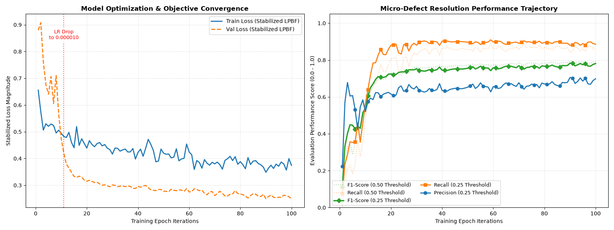

# Model Evaluation
## Training Performance

```
=================== BEST EPOCH 90/100 ===================
Losses -> Train: 0.3484 | Val: 0.2496 | LR: 0.0000100
Metrics (At 0.50 Threshold) -> Prec: 0.7563 | Rec: 0.8412 | F1: 0.7965
Metrics (At 0.25 Threshold) -> Prec: 0.7052 | Rec: 0.8797 | F1: 0.7828
 => Saved new optimum sensitive checkpoint.
```

The following assessments can be made about the training performance:
1. **High Precision + High Recall**

    Out of all the microscopic voids it flags, 75.6% are true defects (very few false alarms caused by background powder or track textures). Additionally, it successfully captures 84% of all physical defects present in the unseen material.
2. **High Confidence Boundaries (0.50 vs. 0.25 Threshold)**

    The F1-Score shifts minimally between the two threshold values, meaning that the model is making highly confident, decisive predictions.

### Key Training Takeaways
1. **Training on Non-Scaled Images Boosts Performance** 

   Previously, I had tried resizing to a standard 256x256 size, however, that removed a significant portion of the microscopic features.
2. **Regularization Strategy Worked Well**
    
    I added aggressive augmentations (e.g., A.GaussNoise, A.GaussianBlur, and A.RandomBrightnessContrast) strictly to the *training* dataset. The training loop was intentionally made artificially "noisy" and difficult to force the U-Net++ decoder to look for deeper geometric properties. This resulted in a higher train loss (`0.3484`) than validation loss (`0.2496`).

## Testing Performance